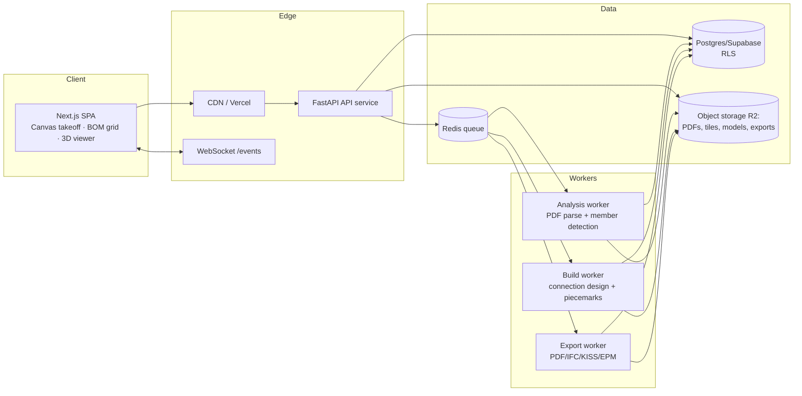

# CalSteel Estimator — Implementation Blueprint & Code-Generation Prompt
**Version 1.0 · 2026-07-07**

**Purpose.** A production-ready blueprint for building an **original** structural-steel estimating platform with capabilities equivalent to the observed reference product (SteelGenie-class: PDF plan ingestion → member takeoff → connection design → BOM → 3D → fabrication exports). It contains **no proprietary code, assets, or IP**; all functionality is specified from feature-level behavior (see `SRS_Internal_Steel_Estimation_Platform.md`) and industry standards (AISC, KISS, IFC). It also builds on the existing in-house codebase audit (`Developer_Handover_SteelGhost.md`) — the extraction engine already written in-house is reused; everything else is specified for original implementation.

**Assumptions (explicit):**
- Team of 4–6 engineers (2 FE, 2 BE/CV, 1 full-stack, 1 DevOps/QA-share); 6–9 months to parity-lite.
- Internal/company deployment first; multi-tenant SaaS optional later.
- US market first: AISC shapes DB, imperial units, ASD/LRFD; metric behind a flag.
- Supabase (Postgres + Auth) and Cloudflare R2 remain the platform choices already in use in-house; alternatives noted where relevant.

---

## 1. End-to-End Architecture



**Explanation.** Stateless API; every long operation (analyse, build, export) is a queued job writing progress to the `jobs` table and broadcasting over WebSocket. Files never travel as base64: PDFs upload straight to R2 via signed URLs; pages are pre-rendered to image tiles served from R2/CDN. Postgres is the single source of truth; RLS enforces tenancy at the row level so even a compromised API key can't cross tenants.

## 2. Frontend Design & UI/UX

**Stack:** Next.js (App Router) + TypeScript strict, Zustand (canvas/editor state) + TanStack Query (server state), TanStack Table (BOM), Three.js (3D), custom Canvas/SVG overlay for takeoff, Tailwind + Radix primitives. Dark theme default (drawing rooms), WCAG AA contrast.

**Routes & screens:**
| Route | Screen | Key elements |
|---|---|---|
| `/login` | Auth | Email+password, MFA (TOTP), SSO button |
| `/projects` | Home | Tabs (Mine/Company/Examples), folders, search, sort, grid/table, create modal (Upload PDF ≤500 MB or Blank; name*, number, status, standard, units, location, description) |
| `/projects/:id` | Takeoff workspace | Left rail: page cards (thumb, sheet no/title, scale select + on-canvas calibration, T.O.S. input, status) and Members panel (grouped counts, search, bulk select, Build/Clean). Center: deep-zoom canvas with toolbar (layer filter, color-by, fit, detection region, reference points, measure, text/annotate, member draw tools, undo/redo, history). Right: properties panel (single + bulk edit: section, rotation, type, status). |
| `/projects/:id/columns` | Column scheduler | Auto groups, elevation diagram (splices, base plate, anchors), per-group member/grid lists, Apply/Reset |
| `/projects/:id/braces` | Braced frames | Frame cards, add-frame flow, search |
| `/projects/:id/bom` | BOM | Filter sidebar (category, piecemark, section, grade, labor code, status, sequence, paint), field chooser, grid, export menu |
| `/projects/:id/config` | Config | Sections: design method (ASD/LRFD), beam-end reactions (source + UDL% slider), seismic frame types, connection types & options, material grades per shape family, size priorities, labor-code routing; AI-suggested defaults with visible rationale; Apply/Reset All |
| `/company/*` | Admin | Overview KPIs, members/roles, invitations, licenses/seats, activity log, labor-code catalog |
| `/settings/*` | Settings | Profile, password, MFA, tickets |

**UX rules:** optimistic edits with undo; skeletons < 200 ms; job progress toasts + page badges ("Analyzing…", "Building…"); disabled tabs deep-link to the blocking action; keyboard shortcuts (C column, M measure, Esc, Ctrl+Z/Y); autosave indicator; virtualized lists everywhere.

**Component hierarchy (abridged):**
```
AppShell(TopBar{ProjectTabs, ExportMenu, Notifications, HelpMenu, Avatar})
 ├ ProjectsHome{FolderBar, SearchSort, ProjectCard|Row, CreateProjectModal}
 ├ Workspace
 │  ├ PageRail{PageCard{Thumb, ScaleSelect, TosInput, StatusSelect}}
 │  ├ MembersPanel{BuildBar, GroupList, BulkActions}
 │  ├ PlanCanvas{TileLayer, OverlayLayer(SVG), ToolController}
 │  ├ CanvasToolbar ├ PropertiesPanel{SummaryTab, MemberTab}
 ├ ColumnScheduler{GroupNav, ElevationDiagram, GroupCards}
 ├ BracedFrames{FrameCard, FrameEditor}
 ├ BomView{FilterSidebar, FieldsChooser, DataGrid, ExportMenu}
 ├ Viewer3D{SceneCanvas, ColorModeSelect, Legend}
 └ ConfigView{SectionNav, ConfigSection×7, InsightBanner, ApplyBar}
```

## 3. Backend Architecture & Business Logic

**Stack:** Python 3.12, FastAPI, SQLAlchemy 2 (or supabase-py repos), Pydantic v2, RQ/Celery on Redis, PyMuPDF + OpenCV (reuse in-house `extraction/` modules: plan boundary, grids, profiles, beams vector+raster, column symbols, brace classifier, eval harness), IfcOpenShell for IFC, openpyxl for Excel, reportlab/pikepdf for marked-up PDFs.

**Package layout:**
```
app/
 ├ api/routers/{auth,projects,drawings,pages,members,config,build,bom,exports,admin}.py
 ├ core/{settings,security,tenancy,events}.py
 ├ services/{ingestion,analysis,engineering,scheduling,bom,export}.py
 ├ extraction/            # existing CV engine, unchanged public API
 ├ engineering/           # NEW original engine (below)
 ├ models/ (ORM) · schemas/ (Pydantic) · workers/{analyse,build,export}.py
 └ tests/ + eval/ (regression harness + drawing corpus)
```

**Engineering (build) engine — original implementation from public standards:**
1. Inputs: validated members (geometry, section, grade), project configuration, AISC v16 shapes database (public), bolt/weld capacity tables computed from AISC 360 equations (ASD Ω / LRFD φ).
2. Beam end reactions: from plan callouts when present; else UDL model `R = w·L·(UDL%/100)/2` per config; flag "Maximum Web Shear" as future mode.
3. Connection selection: rule engine mapping joint type (beam-column flange/web, beam-girder, splice, base plate, brace gusset) + reaction → connection family (double angle / shear tab) → size from plate & bolt priority lists until capacity ≥ demand; options: force-max connection, maximize plate/bolts.
4. Column grouping: cluster columns by section/height/base condition; auto-splice above configured max height.
5. Outputs: piecemarked assemblies (main + accessory items: plates, angles, bolts, welds, studs), BOM rows with weights (from shapes DB, lb/ft × length), column/brace schedules, glTF + IFC model.
6. Determinism: same inputs → same outputs; engine versioned (`build.engine_version`) so BOMs are reproducible and diffable.

**AI integration points** (all optional, feature-flagged, human-in-the-loop):
- Page classification & sheet-title extraction (vision LLM or fine-tuned classifier).
- Scale and T.O.S. suggestion from title block text.
- Config inference from general notes (design method, SFRS) — must emit a plain-language rationale shown in the Config UI, and never auto-apply without user confirmation.
- Member-detection assist already covered by the in-house CV engine; LLM fallback only for low-confidence pages.
Guardrails: log model+prompt versions per suggestion; measure acceptance rate; regression-gate with the eval corpus before model upgrades.

## 4. API Specification (REST + WS, `/api/v1`)

```
Auth (Supabase-issued JWT in Authorization: Bearer)
GET  /me                              PATCH /me
GET|POST /projects                    GET|PATCH|DELETE /projects/{id}
POST /projects/{id}/(clone|share|move|pin)
POST /projects/{id}/drawings          → {upload_url, drawing_id}   (signed R2 PUT)
POST /drawings/{id}/ingest            → job (split, tile, thumbnails, classify)
GET  /drawings/{id}/pages             PATCH /pages/{id}            (scale, tos, status)
GET  /pages/{id}/tiles/{z}/{x}/{y}    (CDN-cached)
POST /pages/{id}/analyse              → {job_id}
GET|POST /pages/{id}/members          PATCH|DELETE /members/{id}   POST /members/bulk
GET|PUT /projects/{id}/configuration  POST .../configuration/reset
POST /projects/{id}/build {page_ids}  → {job_id}
GET  /projects/{id}/column-groups     PATCH /column-groups/{id}
GET|POST /projects/{id}/braced-frames
GET  /projects/{id}/bom?filter…&fields…&page…
POST /projects/{id}/exports {format: pdf|ifc|kiss|epm_xlsx|bom_xlsx} → job
GET  /jobs/{id}                       GET /exports/{id}/download   (signed GET)
Admin: /company/{members|invitations|licenses|activities|labor-codes}
WS   /events   frames: {type: job.progress|job.done|notification, payload}
```
Conventions: cursor pagination; RFC7807 problem+json errors; idempotency keys on POST jobs; all list endpoints filterable; OpenAPI auto-published.

## 5. Database Schema (Postgres, RLS on every table)

```sql
-- tenancy
companies(id uuid pk, name, created_at)
users(id uuid pk ↦ auth.users, company_id fk, name, email, role text
      check (role in ('admin','manager','estimator','viewer')))
licenses(id, company_id, type, valid_until, assigned_user_id)
invitations(id, company_id, email, role, status)
activity_logs(id, company_id, user_id, action, entity, entity_id, ts)

-- projects & documents
folders(id, company_id, name)
projects(id, company_id, owner_id, folder_id, name, number, status,
         design_standard, unit_system, location, description, pinned bool,
         created_at, updated_at)
project_shares(project_id, user_id, permission)
drawings(id, project_id, filename, r2_key, page_count, status)
pages(id, drawing_id, idx int, sheet_no, title, scale_num float, tos_ft float,
      status text, thumb_key, tile_prefix)

-- takeoff
members(id, page_id, kind check in('beam','column','vbrace','hbrace','joist'),
        section, grade, rotation, status, source check in('ai','manual'),
        geometry jsonb, confidence float, created_by, updated_at)
annotations(id, page_id, kind, payload jsonb, author_id)

-- engineering
configurations(project_id pk, payload jsonb, ai_rationale jsonb, revision int)
build_jobs → jobs(id, project_id, page_id, type, status, progress, error,
                  engine_version, started_at, finished_at)
column_groups(id, project_id, name, column_ids uuid[], splice jsonb,
              base_plate jsonb, anchors jsonb, warnings jsonb)
braced_frames(id, project_id, name, geometry jsonb)
bom_items(id, project_id, build_id, piecemark, category, qty, section_type,
          section, length_in numeric, grade, labor_code, weight_lbs numeric,
          camber, cope int, holes int, weld_studs int, status, sequence,
          paint, is_main bool, custom jsonb)
labor_codes(id, company_id, code, category, shape_pattern, project_id nullable)
export_jobs(id, project_id, format, status, r2_key)
notifications(id, user_id, type, title, body, read_at)
```
Indexes on all FKs + `bom_items(project_id, category)`, `members(page_id, kind, status)`. RLS: company_id chain (mirror the proven policy pattern already in `infra/001_initial.sql`). Migrations via sqitch/supabase CLI, expand-contract only.

## 6. AuthN/AuthZ

- Supabase Auth: email+password, TOTP MFA, optional SAML/OIDC SSO later. JWT verified in FastAPI dependency; `company_id`+`role` claims mirrored into `users`.
- RBAC: admin (company settings), manager (all company projects + admin-lite), estimator (own/shared projects RW), viewer (RO). Project ACL via `project_shares`.
- Defense in depth: RLS is authoritative; API-level checks are UX. Signed URLs (15-min) for all file access; upload paths are UUID keys — never user filenames (fixes the path-traversal risk found in the audit). Rate limiting per user; audit log middleware writes `activity_logs`.

## 7. DevOps / CI-CD / Deployment

- **Repo:** monorepo (`frontend/`, `backend/`, `infra/`), trunk-based, conventional commits, PR review + CI required.
- **CI (GitHub Actions):** lint (ruff/eslint) → typecheck → unit tests → **extraction eval harness vs baseline (hard gate)** → build Docker images → deploy preview (Vercel FE, staging BE).
- **CD:** staging auto on merge; prod by tagged release, blue/green on the API, workers drained gracefully; DB migrations run pre-deploy (backward-compatible only).
- **Runtime:** FE on Vercel; API+workers as containers (Fly.io/ECS) — API ×2 min, workers autoscale on queue depth; Redis managed; Supabase managed Postgres (PITR backups); R2 with lifecycle rules (raw uploads 1 y, tiles regenerable).
- **Observability:** Sentry (FE+BE), OpenTelemetry traces, structured JSON logs, dashboards for job latency/failure rate, weekly extraction-quality report from the eval corpus.
- **Secrets:** platform secret stores only; `.env` never committed (rotate anything from the old repo); dependabot + image scanning.

## 8. Testing Strategy

| Layer | Approach |
|---|---|
| Extraction | Existing eval harness (phantom/overshoot/duplicate/count metrics) + labeled ground-truth corpus; CI regression gate |
| Engineering engine | pytest golden tests against AISC design-example values; property tests (capacity monotonic in bolt count/plate size); determinism test (same input → identical BOM hash) |
| API | pytest + httpx: authz matrix per role, RLS cross-tenant probes, upload validation, job lifecycle |
| Frontend | Vitest component tests (canvas coordinate math!), Playwright E2E: upload→analyse→correct→build→BOM→export |
| Exports | Schema validators: KISS syntax, EPM template columns, IFC via IfcOpenShell round-trip |
| Performance | k6: 50 concurrent analyses; canvas FPS budget on 5k-member sheet |
| Security | OWASP ZAP baseline in CI; annual pentest; dependency audit |

## 9. Performance Optimization

Deep-zoom tiles (256 px, 4 zoom levels) instead of base64 pages; SVG overlay virtualization (render only viewport members); web-worker hit-testing; debounced bulk PATCH; Postgres `COPY` for BOM writes; Redis cache for shapes DB; HTTP caching (ETag) on tiles/thumbnails; job sharding per page (parallel builds); glTF with instanced meshes for 3D; target budgets: page open < 1.5 s, analyse < 30 s/sheet, build < 60 s/project, BOM grid < 300 ms/1k rows.

## 10. Developer Documentation Outline

1. Getting started (devcontainer, seed data, sample drawings) · 2. Architecture overview (this doc) · 3. Domain glossary (piecemark, T.O.S., KISS, camber…) · 4. Extraction engine guide + how to add eval cases · 5. Engineering engine spec (rules, AISC references, versioning) · 6. API reference (generated OpenAPI) · 7. DB schema & migration policy · 8. Frontend canvas architecture · 9. Runbooks (job stuck, model rollback, restore) · 10. Contribution guide & coding standards.

## 11. Coding Standards

Python: ruff+black+mypy strict in `engineering/`; no business logic in routers; services pure/testable; docstrings on public functions. TypeScript: strict, no `any`, components ≤ 300 lines, hooks for logic, Zod-validated API responses. Both: feature flags for incomplete work (ship "Under development" states rather than long branches), ADRs for irreversible decisions, PR ≤ 400 lines preferred.

## 12. Milestones

| M | Weeks | Exit criteria |
|---|---|---|
| M0 Foundations | 1–3 | Monorepo, CI, auth, projects CRUD, R2 upload, page tiling |
| M1 Takeoff | 4–9 | Canvas editor + reused extraction engine behind jobs; member edit/bulk; scale/T.O.S./status persisted; eval gate live |
| M2 BOM v1 | 10–13 | Shapes DB, weights, BOM grid + filters, CSV/KISS export |
| M3 3D | 14–15 | glTF build, Three.js viewer, color modes |
| M4 Engineering | 16–24 | Config module, connection engine, piecemarks, EPM export, column scheduler |
| M5 Braces + IFC + PDF | 25–30 | Braced frames, IFC/marked-up PDF exports |
| M6 Collaboration/Admin | 31–36 | Roles, sharing, activity log, notifications, labor-code catalog |
| GA hardening | 37+ | Perf/security audits, docs complete, on-call runbooks |

---

## 13. Master Code-Generation Prompt (for AI-assisted scaffolding)

> You are building **CalSteel Estimator**, an original structural-steel estimating web platform (no third-party proprietary code or assets). Monorepo with `frontend/` (Next.js App Router, TypeScript strict, Tailwind, Zustand, TanStack Query/Table, Three.js) and `backend/` (Python 3.12, FastAPI, SQLAlchemy 2, Pydantic v2, RQ workers on Redis, PyMuPDF/OpenCV, Supabase Postgres with RLS, Cloudflare R2 via signed URLs).
> Implement per the specification in `Implementation_Blueprint_CalSteel.md`: (1) the schema in §5 as migrations with RLS policies; (2) the REST/WS API in §4 with OpenAPI, RFC7807 errors, cursor pagination, JWT auth dependency and role checks per §6; (3) job-based ingestion→tiling→analysis→build→export pipeline per §1/§3, with progress events on `/events`; (4) the screens/components in §2 with optimistic updates and virtualization; (5) the deterministic engineering engine per §3 using the public AISC shapes database and AISC 360 capacity equations, versioned and golden-tested; (6) tests per §8 including the extraction eval harness as a CI gate.
> Constraints: no base64 file transport; UUID object keys; feature-flag incomplete features; every long operation is a job; all code typed, linted, and covered by the specified tests. Generate code module-by-module in the package layout of §3, starting with M0 items in §12.

---

*Companion documents: `SRS_Internal_Steel_Estimation_Platform.md` (feature-level requirements from observed behavior) and `Developer_Handover_SteelGhost.md` (current-code audit; reuse `extraction/` + eval harness, replace the rest).*
